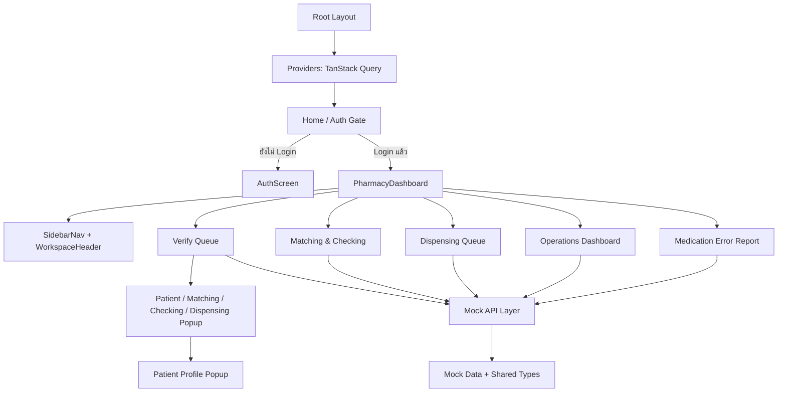

# JurapornWeb — Architecture, UI Theme และ Responsive Review

> วันที่ตรวจสอบ: 13 กรกฎาคม 2026  
> ขอบเขต: ไฟล์ source code และ configuration ทั้งหมดของโปรเจกต์ (ไม่นับ generated files ใน `.next/`, dependencies ใน `node_modules/` และ metadata ใน `.git/`)
>
> **ลำดับการอ่าน:** อ่านไฟล์นี้ก่อน แล้วอ่าน [คู่มือทำงานต่อจากระบบเดิม](./CONTINUE_DEVELOPMENT.md)  
> path ของ source code และ configuration ในเอกสารนี้อ้างอิงจาก project root

## 1. Executive Summary

JurapornWeb คือ Frontend Prototype สำหรับระบบห้องจ่ายยาผู้ป่วยนอก (PharmAuto OPD) พัฒนาด้วย Next.js 16, React 19, TypeScript, Tailwind CSS 4, TanStack Query และ UI primitives แบบ shadcn/Radix โดยปัจจุบันทำงานเป็น Single-page Workstation ที่เปลี่ยนหน้าผ่าน React state และใช้ mock API จำลอง latency ของ backend

ภาพรวมคุณภาพโครงสร้างอยู่ในระดับดีสำหรับ prototype:

- แยกโค้ดตาม feature ชัดเจน (`auth`, `queue`, `verify`, `matching`, `checking`, `dispensing`, `dashboard`, `medication-error`, `shell`)
- มี type กลางครอบคลุมข้อมูล workflow และ response
- แยก data-access functions ออกจาก UI และใช้ TanStack Query จัดการ asynchronous state
- Theme มีภาษาภาพสม่ำเสมอ: พื้นหลังเทาอ่อน, card สีขาว, Primary สีน้ำเงิน, สีสถานะตามความหมาย และ navigation สีน้ำเงินเข้ม
- Desktop รองรับดี ส่วน Mobile รองรับในระดับใช้งานได้ แต่ก่อนปรับปรุงมีปัญหาเรื่อง viewport height, safe area, master/detail layout และตารางกว้าง

สถานะปัจจุบันหลังการปรับปรุงในรอบนี้: Responsive ดีขึ้นโดยไม่เปลี่ยน Theme เดิม และผ่าน `eslint`/production build

## 2. Architecture Overview



### Runtime flow

1. `src/app/layout.tsx` สร้าง root document, metadata, Query provider และ Toaster
2. `src/app/page.tsx` ทำหน้าที่เป็น auth gate ระหว่าง Login กับ Pharmacy Workstation
3. `PharmacyDashboard` เป็น application shell/orchestrator หลัก ควบคุม screen, queue tab, search และ popup
4. แต่ละ screen เรียก mock API ผ่าน TanStack Query
5. เมื่อเลือกผู้ป่วย ระบบเลือก popup ตามสถานะ `checking`, `dispensing`, `matching` หรือ fallback เป็น `verify`

### รูปแบบ State ปัจจุบัน

- Server-like state: TanStack Query
- UI state: `useState` ภายในแต่ละ feature
- Session: `localStorage` ถูกเขียน/ลบ แต่ยังไม่ได้ restore เมื่อ reload
- Routing: React state ภายในหน้าเดียว ยังไม่มี URL route ต่อ screen
- Persistence: ไม่มี ทุก action ยังเป็น prototype/local state

## 3. Classification — การจำแนกไฟล์

### 3.1 ไฟล์หน้าหลัก (Main Pages / Screens)

| ไฟล์ | หน้าที่ |
|---|---|
| `src/app/page.tsx` | Entry page และ auth gate หลัก |
| `src/features/auth/AuthScreen.tsx` | หน้า Login/Register แบบ mock |
| `src/features/queue/PharmacyDashboard.tsx` | Workstation shell และตัวควบคุมหน้าหลักทั้งหมด |
| `src/features/dashboard/OperationsDashboard.tsx` | หน้าสรุป KPI, workload, waiting time และ system alerts |
| `src/features/workflow/MatchingCheckingScreen.tsx` | หน้ากระบวนการ Matching และ Checking แบบ master/detail |
| `src/features/dispensing/DispensingQueueScreen.tsx` | หน้าคิวเรียกและจ่ายยาแบบ master/detail |
| `src/features/medication-error/MedicationErrorScreen.tsx` | หน้ารายงาน Medication Error และ severity distribution |

### 3.2 ไฟล์หน้ารอง / Components / Popups

| กลุ่ม | ไฟล์ | หน้าที่ |
|---|---|---|
| Queue | `MobileQueueList.tsx` | รายการคิวรูปแบบ card สำหรับ Mobile |
| Queue | `QueueTable.tsx` | ตารางคิวสำหรับ Tablet/Desktop |
| Queue | `queue-ui.tsx` | Mapping สี, icon, label และ duration ของ queue |
| Verify | `PatientPanel.tsx` | แผง Verify ผู้ป่วย, LAB, รายการยา, HAD และ ME modal |
| Verify | `MachineStockCheck.tsx` | ผลตรวจเครื่องจัดยาและ stock |
| Matching | `MatchingPopup.tsx` | popup รายละเอียด prescription/medicine/basket |
| Checking | `CheckingCheckoutPopup.tsx` | popup ตรวจยาและตะกร้า |
| Dispensing | `DispensingPopup.tsx` | popup จ่ายยา, scan, directions และ precautions |
| Patient | `PatientProfilePopup.tsx` | popup โปรไฟล์, reconcile และ interaction |
| UI | `src/components/ui/button.tsx` | Button primitive และ variants |
| UI | `src/components/ui/input.tsx` | Input primitive |
| UI | `src/components/ui/badge.tsx` | Badge primitive |

### 3.3 ระบบนำทาง / Routing / Popup

| ไฟล์ | บทบาท |
|---|---|
| `src/features/shell/SidebarNav.tsx` | Desktop sidebar และ Mobile bottom navigation |
| `src/features/shell/WorkspaceHeader.tsx` | Header, summary badges, live clock, global search และ logout |
| `src/features/shell/shell-types.ts` | Type ของ screen/navigation item |
| `src/features/queue/PharmacyDashboard.tsx` | State-based screen routing, queue tabs และ popup routing |
| `src/features/verify/PatientPanel.tsx` | Nested modal routing สำหรับ Profile, HAD และ ME |
| `MatchingPopup.tsx`, `CheckingCheckoutPopup.tsx`, `DispensingPopup.tsx` | Overlay/popup เฉพาะ workflow และ nested Patient Profile |

> หมายเหตุ: ระบบนี้ยังไม่ใช้ Next.js route แยกหน้า ทุก screen จึงอยู่ภายใต้ URL เดียวและควบคุมด้วย `activeScreen`/`selectedId`

### 3.4 Application Foundation

| ไฟล์ | หน้าที่ |
|---|---|
| `src/app/layout.tsx` | Root HTML, metadata, Providers และ Toaster |
| `src/app/providers.tsx` | สร้าง `QueryClient` และ `QueryClientProvider` |
| `src/app/globals.css` | Global theme tokens, typography, scrollbar, focus และ safe-area utility |
| `src/lib/utils.ts` | รวม class ด้วย `clsx` + `tailwind-merge` |

### 3.5 Data, API และ Types

| ไฟล์ | หน้าที่ |
|---|---|
| `src/types/pharmacy.ts` | Domain types ของ queue, patient, stock และ popup responses |
| `src/lib/mock-pharmacy.ts` | Mock queue/patient data และ summary builder |
| `src/lib/pharmacy-api.ts` | Mock API ของ queue, matching, checking และ dispensing |
| `src/lib/patient-profile-api.ts` | Mock API โปรไฟล์ผู้ป่วย |
| `src/lib/stock-check-api.ts` | Mock API ตรวจ stock/เครื่อง |
| `src/lib/workstation-api.ts` | Types และ mock API ของ workflow, dispensing, dashboard และ ME |

### 3.6 Configuration

| ไฟล์ | หน้าที่ |
|---|---|
| `package.json`, `package-lock.json` | Dependencies และ scripts |
| `next.config.ts` | Next.js configuration |
| `tsconfig.json`, `next-env.d.ts` | TypeScript/Next types |
| `eslint.config.mjs` | Next Core Web Vitals + TypeScript lint |
| `postcss.config.mjs` | Tailwind PostCSS plugin |
| `components.json` | shadcn component convention และ aliases |
| `.gitignore` | รายการไฟล์ที่ไม่เก็บใน Git |

## 4. Theme/UI Analysis — กฎที่ต้องรักษา

### Theme DNA

- ลักษณะ: Clinical operations dashboard ที่สะอาด อ่านข้อมูลเร็ว และมีความหนาแน่นปานกลาง
- Layout: พื้นหลัง workspace เทาอ่อน + card/panel สีขาว + เส้นขอบบาง + shadow เบา
- Navigation: Navy `#0f1f3d` และ active surface `#1d3461`
- Primary: Blue `#2f6bf3` / Tailwind blue-600
- Status semantics:
  - Success/Complete: Green `#16a34a`
  - Warning/Pending/Matching: Orange/Amber `#e07d12`
  - Danger/Stat/Error: Red `#d83a3a`
  - Dispensing: Cyan `#0a8bb0`
  - Picking: Violet `#7a5cff`
- Typography: `IBM Plex Sans Thai` เป็นตัวเลือกแรก แล้ว fallback ไป system/Noto Sans Thai
- Numbers/IDs/Time: ใช้ `font-mono` เพื่อให้อ่านค่า VN, HN, เวลา และ metric ง่าย
- Shape language: มุมโค้ง 8–24px โดย card หลักมักใช้ `rounded-2xl`/`rounded-3xl`
- Iconography: Lucide icons แบบเส้นสม่ำเสมอ
- Interaction: ปุ่มสูง 36–44px, hover surface อ่อน, focus ring สีน้ำเงิน

### Theme Preservation Contract

การพัฒนาต่อควรรักษากฎต่อไปนี้:

1. ห้ามเปลี่ยน Primary palette, Navy navigation, สีสถานะ และความหมายของสี
2. ใช้ card สีขาวบนพื้นหลัง `#eef1f5`; หลีกเลี่ยง gradient ใหม่ใน workstation (gradient ปัจจุบันยอมรับเฉพาะหน้า Auth/brand mark)
3. ใช้ `Button`, `Input`, `Badge` primitives ก่อนสร้าง style ใหม่
4. ใช้มุมโค้ง, border และ shadow ในระดับเดียวกับ component เดิม
5. ใช้สีแดง/ส้ม/เขียวตาม semantic เดิม ไม่ใช้เป็นสีตกแต่งทั่วไป
6. รักษาความหนาฟอนต์สูงใน heading/status และใช้ mono กับข้อมูลเชิงรหัส/ตัวเลข
7. Mobile ควรเปลี่ยน “รูปแบบการจัดวาง” ไม่ใช่เปลี่ยน “รูปแบบภาพ” เช่น table → card, sidebar → bottom nav

## 5. Responsive Design Review

### ก่อนปรับปรุง

จุดที่ทำได้ดี:

- Auth page เปลี่ยนจาก 1 column เป็น 2 columns ที่ `lg`
- Queue แยก Desktop table และ Mobile cards ชัดเจน
- Sidebar เปลี่ยนเป็น bottom navigation บน Mobile
- Dashboard metrics และ severity grid มี responsive columns
- Popup ส่วนใหญ่ใช้ full width บนจอเล็กและ split view บนจอใหญ่
- ปุ่ม action หลายจุด stack เป็น column บน Mobile

จุดที่ยังขาด:

| ระดับ | ปัญหา | ผลกระทบ |
|---|---|---|
| สูง | ใช้ `h-screen`/`100vh` | Mobile browser chrome และ virtual keyboard อาจบังเนื้อหา/ปุ่มท้ายหน้า |
| สูง | Master/detail บน Matching และ Dispensing ไม่มีการกำหนด mobile row height | รายการด้านบนอาจใช้ความสูงมากจนรายละเอียดด้านล่างเหลือพื้นที่น้อยหรือ scroll ไม่เป็นอิสระ |
| สูง | Patient Profile: Medical Reconcile table ไม่อนุญาต horizontal scroll | 4 columns ถูกบีบหรือล้นบนจอแคบ |
| กลาง | Bottom nav ไม่มี safe-area inset | ปุ่มอาจชิด/ถูกบังโดย home indicator บน iPhone |
| กลาง | Matching prescription ใช้ grid ขั้นต่ำกว้างประมาณ 340px บวก padding | ข้อมูลวันที่อาจถูกตัดบนอุปกรณ์ 320–375px |
| กลาง | Patient info rows ล็อก label column 170px | ค่าใน column ขวาแคบเกินไปบน Mobile |
| ต่ำ | Search header ไม่มี `w-full` ใน base breakpoint | ความกว้างบน Mobile ขึ้นกับ flex sizing มากเกินไป |
| ต่ำ | Scrollbar ขนาด desktop บน Mobile | กินพื้นที่และดูหนักเมื่อมี nested scroll |

### การแก้ไขที่ทำแล้ว

- เปลี่ยน application shell และ overlays เป็น dynamic viewport (`h-dvh`)
- เพิ่ม safe-area padding ให้ bottom navigation และ footer ของ Verify panel
- กำหนด Mobile master/detail rows เป็นรายการสูงไม่เกินประมาณ 34dvh และ detail ใช้พื้นที่ที่เหลือ
- ทำ Medical Reconcile table ให้เลื่อนแนวนอนได้ พร้อมกำหนดความกว้างขั้นต่ำที่อ่านง่าย
- เปลี่ยน info rows เป็น stacked layout บน Mobile
- เปลี่ยน Matching prescription เป็น card-like stacked row บนจอเล็ก และคง table grid บน `sm` ขึ้นไป
- กำหนด header search ให้เต็มความกว้างบน Mobile
- เพิ่ม touch handling, visible keyboard focus และ scrollbar ขนาดเล็กบน Mobile
- รักษา palette, typography, spacing scale, card shape และ component hierarchy เดิมทั้งหมด

### Breakpoint behavior หลังปรับปรุง

| Viewport | Behavior |
|---|---|
| `< 640px` | Header stack, full-width search, card lists, stacked actions, stacked profile rows |
| `640–767px` | ใช้พื้นที่แนวนอนเพิ่มสำหรับ form/action และ profile fields |
| `768–1023px` | Sidebar ซ้าย, queue table, master/detail 2 columns |
| `1024–1279px` | Popup content เริ่มใช้ grid หลายคอลัมน์และ desktop controls |
| `≥ 1280px` | รองรับ popup + patient profile แบบ side-by-side และ dashboard layout เต็ม |

## 6. Code Quality และ Architecture Findings

### จุดแข็ง

- TypeScript strict mode และ domain types ชัดเจน
- Feature folders สอดคล้องกับ business workflow
- API mock ถูกแยกจาก presentation ทำให้เปลี่ยนเป็น `fetch` จริงได้โดยไม่รื้อ UI
- Query keys แยกตามข้อมูล/ผู้ป่วย
- Shared UI components และ `cn()` ลด class conflict
- Loading states มีในทุกหน้าหลัก

### ความเสี่ยง / Technical Debt

1. **Authentication ยังไม่ใช่ security boundary** — ตรวจ credential ฝั่ง client และใช้ local state เท่านั้น
2. **Session restore ไม่สมบูรณ์** — มีการเขียน `pharmauto-session` แต่ reload แล้วกลับหน้า Login เพราะไม่ได้อ่านค่าเริ่มต้น
3. **ไม่มี URL routing ต่อ workstation screen** — refresh/deep link/back-forward ไม่สามารถรักษาหน้าปัจจุบัน
4. **Mock summary ไม่สอดคล้องกับรายการจริงบางค่า** — `buildQueueResponse()` คำนวณแล้ว override บาง stage แบบ hard-code
5. **Action ส่วนมากยังไม่ persist** — ปุ่ม Verify, ส่ง MDR, Hold, save checkout, ME report และ queue update ยังเป็น UI prototype
6. **Domain types กระจายสองตำแหน่ง** — types บางส่วนอยู่ใน `src/types/pharmacy.ts` แต่ workflow types อยู่ใน `workstation-api.ts`
7. **Patient profile ใช้ query key คนละชุด** — inline และ popup อาจ fetch mock profile ซ้ำ (`patient-profile-inline` กับ `patient-profile`)
8. **ไม่มี automated tests** — ยังไม่มี unit, component, integration หรือ E2E coverage
9. **Modal accessibility ยังไม่ครบ** — ควรเพิ่ม focus trap, Escape handling, `role="dialog"`, `aria-modal` และ focus restoration
10. **Theme token ยังใช้ไม่เต็มที่** — มี CSS variables แต่ component จำนวนมากใช้ hex/Tailwind color โดยตรง ทำให้แก้ theme ในอนาคตยาก

## 7. Recommendations ตามลำดับความสำคัญ

### P0 — ก่อนเชื่อม Production Backend

- ทำ authentication/session ฝั่ง server หรือผ่าน identity provider และเพิ่ม route protection
- กำหนด API contracts, error schema, timeout/retry และ permission ของแต่ละ workflow action
- ทำ mutation จริงพร้อม optimistic/rollback strategy เฉพาะ action ที่เหมาะสม
- เพิ่ม audit trail สำหรับ Verify, HAD, ME, Matching, Checking และ Dispensing

### P1 — ความเสถียรและการใช้งาน

- ย้าย screen state ไป URL route/search params เพื่อรองรับ refresh/deep link/back button
- รวม domain types ไปไว้ใน `src/types/` และแยก mock fixtures ออกจาก API functions
- เพิ่ม Error/Empty states มาตรฐานและ error boundary
- เพิ่ม modal focus management และ keyboard navigation
- เพิ่ม component tests สำหรับ filtering, stage transition, popup selection และ form validation
- เพิ่ม responsive regression tests อย่างน้อยที่ 360×800, 768×1024, 1366×768 และ 1920×1080

### P2 — Maintainability

- เปลี่ยนสีที่ใช้ซ้ำเป็น semantic tokens เช่น `--status-verify`, `--status-danger`, `--nav-bg`
- แยก complex sections ใน `PatientPanel.tsx` เป็น component ย่อย
- รวม severity metadata ของ Medication Error ให้มี source เดียว
- เพิ่ม formatter/CI pipeline สำหรับ lint, type check, test และ build

## 8. Suggested API Migration Pattern

รักษา public function ของ data layer เดิม เช่น `getPharmacyQueue()` แล้วเปลี่ยน implementation ภายในจาก mock เป็น HTTP client เพื่อไม่ให้ screen components ต้องเปลี่ยนพร้อมกัน ควรมีโครงสร้างระยะถัดไปดังนี้:

```text
src/
  features/
    queue/
      api/
      components/
      hooks/
      screens/
  services/
    http-client.ts
  types/
    queue.ts
    patient.ts
    workflow.ts
```

ยังไม่จำเป็นต้อง refactor ทันที เพราะโครงสร้างปัจจุบันเหมาะกับขนาด prototype แต่ควรทำเมื่อ backend contract เริ่มนิ่ง

## 9. Validation Checklist

- [x] อ่าน source/configuration ทุกไฟล์ในขอบเขตโปรเจกต์
- [x] จำแนก Main Pages, Sub Pages/Components และ Navigation/Routing/Popup
- [x] บันทึก Theme Preservation Contract
- [x] ตรวจ breakpoint, overflow, viewport height และ safe area จากโค้ด
- [x] ปรับ Responsive โดยไม่เปลี่ยน Theme เดิม
- [x] ESLint ผ่าน
- [x] Next.js production build ผ่าน

## 10. สรุป

โค้ดชุดนี้มีฐาน architecture ที่เหมาะกับการพัฒนา prototype ต่อ: feature separation ดี, types ชัด, async data layer แยกจาก UI และ Theme สม่ำเสมอ หลังแก้ Responsive รอบนี้ การใช้งาน Mobile มีความปลอดภัยขึ้นในจุดสำคัญโดยเฉพาะ viewport, bottom navigation, master/detail และข้อมูลตารางกว้าง

สิ่งที่ควรทำถัดไปไม่ใช่เปลี่ยน UI แต่เป็นยกระดับจาก prototype ไปสู่ production architecture ได้แก่ authentication จริง, URL routing, mutation/persistence, audit trail, error handling และ automated tests โดยยึด Theme Preservation Contract ในเอกสารนี้เป็นข้อกำหนดร่วมของงานพัฒนาต่อไป
